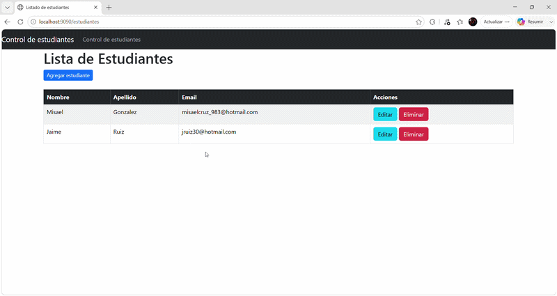

# Control de Estudiantes (CRUD Monolítico)

Una aplicación web monolítica desarrollada en Java con **Spring Boot** que implementa un sistema CRUD completo para la gestión, registro, edición y eliminación de alumnos, utilizando renderizado del lado del servidor (SSR).

## Demostración Visual

## Tecnologías Utilizadas
* **Java** (Lenguaje principal)
* **Spring Boot** (Framework base)
* **Thymeleaf** (Motor de plantillas para el renderizado del lado del servidor)
* **Spring Data JPA & Hibernate** (Abstracción de la persistencia de datos)
* **MySQL** (Base de datos relacional)
* **Bootstrap 5** (Diseño responsivo de la interfaz)
* **Gradle** (Gestor de dependencias y construcción del proyecto)

## Características Principales
* **Desarrollo Monolítico Tradicional:** Toda la lógica de negocio y las vistas web se procesan e integran de manera nativa desde el servidor de Spring Boot (Puerto `9090`).
* **Persistencia Robusta:** Conexión directa a base de datos MySQL gestionando operaciones transaccionales seguras mediante JPA.
* **Flujo Dinámico:** Navegación fluida entre pantallas para agregar nuevos estudiantes, modificar registros en tiempo real y eliminar datos de forma segura.
